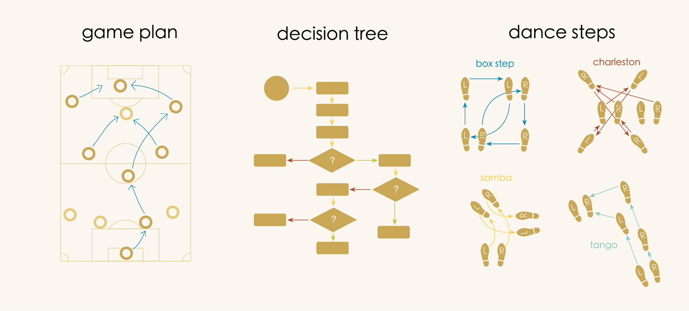
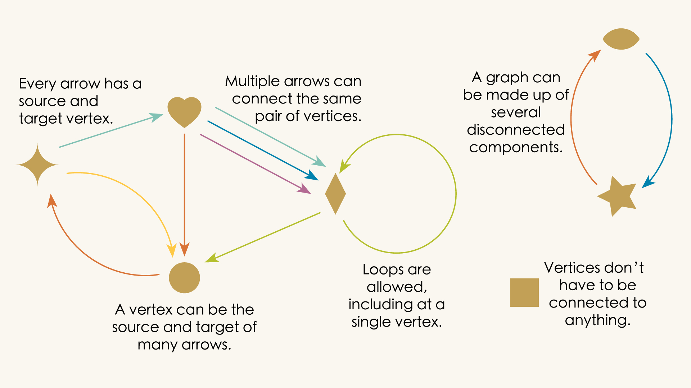
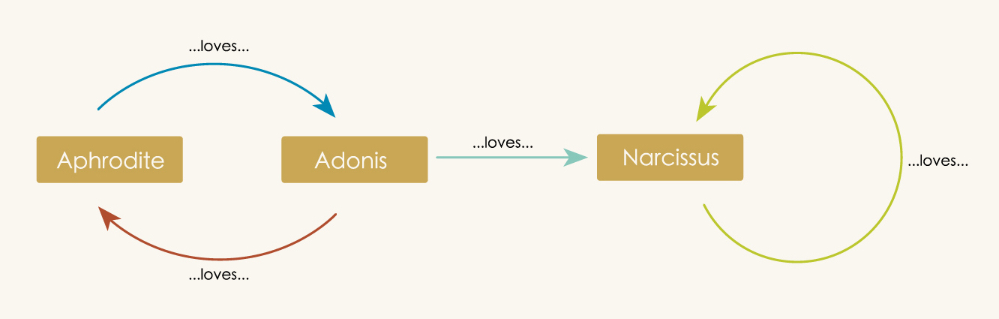

---
jupytext:
  formats: md:myst
  text_representation:
    extension: .md
    format_name: myst
kernelspec:
  display_name: Julia 1.10
  language: julia
  name: julia-1.10
---

# Chapter 0: Directed Graphs

## 0.1 What is a directed graph?

We will begin our journey into relational thinking and AlgebraicJulia by looking at a particularly simple modeling system called a *directed graph*. Anyone who's ever used a flow chart, studied a subway map, or learned the Charleston will have encountered the basic idea.



What do these diagrams all have in common? First, they all have arrows. Second, they all have some “points” (players, footprints, questions, etc.), and every arrow connects one point to some other point. More formally these points are usually known as "vertices" (”vertex” when singular), and the official rules for directed graphs are: 



It's a simple setup but many situations in life - many *systems* - are well-captured by this kind of diagram.

Consider how we can use directed graphs to represent the following three situations:


:::{admonition} Mythological Romance


**Aphrodite loves Adonis and Adonis loves Aphrodite. But Adonis is polyamorous and is also in love with Narcissus. And Narcissus, of course, loves only himself.**

We can make a directed graph of these relationships in which the vertices are characters and an arrow indicates that the person at the source loves the person at the target.




:::


:::{admonition} Ski Trip Brochure:


**From our ski lodge, you can take the lift to the top of the mountain. Skiing down the slope will take you to an isolated Alpine village in a valley where you can cross-country ski around the surrounding landscape. Of course, some people don't know how to ski. If that sounds like you, don't worry! You can still visit the mountain top to see the beautiful view and then just jump back on the lift and return to the lodge.**

In this directed graph, the vertices are locations and the arrows are "modes of transport" from one location to another.


If you squint, you can look at this like a simplified map. We've left out the trees and the geography and the distances from one place to another. We've distilled our wayfinding to only the most essential details needed for getting around.


:::


:::{admonition} Whose Turn Is It To Do the Dishes?


**Paul and his wife Toni used to trade off doing the dishes each day. Then their friend Tuco moved in who loves doing dishes and he has done them ever since. Toni was the last one to do the dishes before Tuco took over.**

In this directed graph, the vertices are once again people and each arrow connects two people who may do dishes on consecutive days.

```{image} assets/Ch5/DGdishes.png
:alt: Whoopsy!
:width: 800px
:align: center
```


:::

Looked at individually, each of the above situations seem quite different. But their directed graphs make it clear that they all share the same essential structure. Abstractly, they are all the same graph, which we can represent in unlabeled form:


When used casually like this, directed graphs are little more than convenient pictures–visual heuristics that make it easier to think about the underlying situations. Over the course of this book we will adopt a more formal point of view, unpacking the capabilities of AlgebraicJulia through an extended look at directed graphs and related ideas.  


## 0.2 Why directed graphs?


Why are we choosing to focus on directed graphs? 

In one sense, directed graphs give us a nice combination of simplicity and versatility. They are both easy to understand and rich in terms of applications. They are conveniently pictographic, allowing us to make pretty illustrations, but are also a powerful _formal_ tool, something we can communicate to a computer in order to model complex systems. As we try to get a sense of what AlgebraicJulia is all about, it is helpful to be working with something that is both accessible and deep.

But the real reason we want to look at directed graphs because they are also _fragile_.

Suppose we've modeled some situation in a computer using a directed graph. If our understanding of that situation changes then we're going to want to update the details of our graph to reflect this improved understanding. Specifically, we'll need the ability to add and delete components as necessary. The problem seems to be that, if we have the ability to freely add and delete graph components then there's nothing to stop us from making _broken graphs_!

//IMAGE OF BROKEN GRAPH


 If we're trying to represent the world with a directed graph then a broken graph is a big problem because it invalidates the underlying model. It's not that the model becomes incorrect. It becomes meaningless. If "loves" needs both a lover and a beloved then the following is an undefined/ungrammatical..."Tuco loves". Rupturing our graph in this way also ruptures any underlying meaning the graph may have had.


And an unfortunate fact of life is that directed graphs a prone to getting broken in this way. We can try to exercise care when merging graphs, separating subgraphs, performing surgical replacement on sections of graphs. All of these introduce complicated edge cases in which arrows and vertices may end up becoming detached. 

The problem is that these tools exist at a level of abstraction that people are simply not accustomed to thinking about. We will have to move through many layers of abstraction to get where we're going, and much of it will seem unnecessarily abstract at first. . But in the end, we will arrive at the concept of a "Double Pushout Rewrite Rule," a category theoretic design pattern that allows us to perform intricate surgery on graphs without having to give a seconf thought to the dangling edge condition. In the process, and with the help of Algebraic Julia, you will learn new tools for thinking about relationships. 

Although we will talk at length about directed graphs, this isn't really a book about directed graphs. The real goal of this book is to give you a taste of what we're calling "relational thinking." 


AlgebraicJulia is being developed as an ecosystem serious scientific modeling platform. But in order to use AlgebraicJulia effectively you need to have some sense of the way to organize your thoughts on that platform. We wrote this book to show how a simple and chronic practical problem - `DANGLING EDGES` - can be handled elegantly from a relational viewpoint. We hope this simple example gives you a taste of how categorical computation works and an appetite to find out more.

