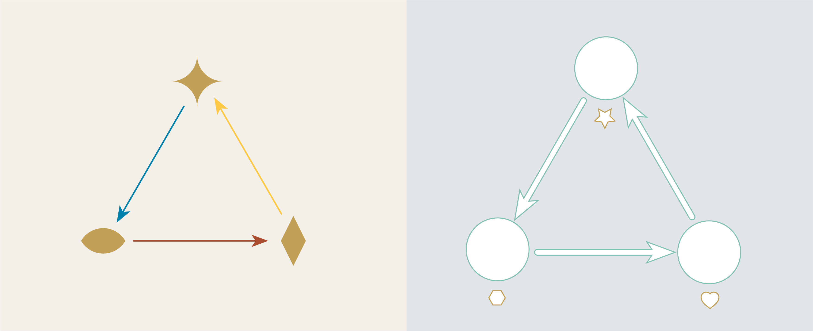
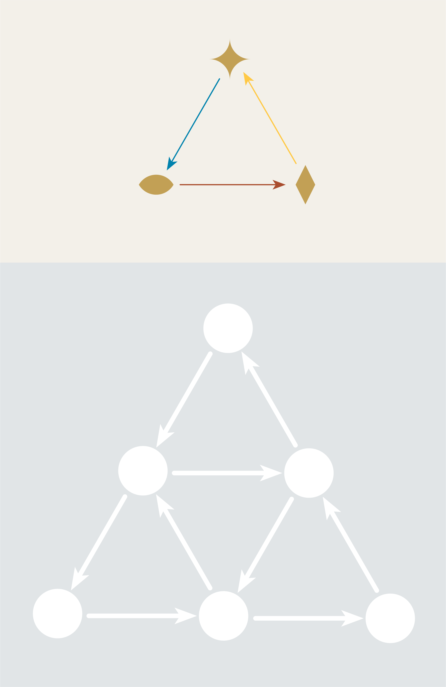

---
jupytext:
  formats: md:myst
  text_representation:
    extension: .md
    format_name: myst
kernelspec:
  display_name: Julia 1.10
  language: julia
  name: julia-1.10
---

# Chapter 4: Categories

:::{note}
This book is a work-in-progress! We'd love to learn how we can make it better, especially regarding fixing typos or sentences that are unclear to you. Please consider leaving any feedback, comments, or observations about typos in [this google doc](https://docs.google.com/document/d/1MvhNuap0QLMAfrMQLIAxbclBx0vjt6vyK8BhVhLwFoQ/edit).
:::

## 4.1 Introduction

For any given a schema there will be many possible instances. Below we show a few of the instances for each of our three graph schemas.

```{image} assets/Ch3/ThreeSchemas.png
:alt: Whoopsy!
:width: 800px
:align: center
```
<br>

Of course, each of these schemas actually have an *infinite* number of possible instances (graphs can be arbitrarily big!). It isn't practical to show _every_ instance, but it is possible to just visualize them in your imagination, all floating in space, one endless swarm of things the schema might refer to. 

```{image} assets/Ch4/InstanceDrift.gif
:alt: Whoopsy!
:width: 800px
:align: center
```

<br>

In our ongoing quest to think about things in terms of relationships we should look at these thought bubbles, each floating in isolation from the others, and ask ourselves, "How are these instances related to one another?"

In this chapter we will develop a powerful answer to this question. 

Let's set this swarm of thought bubbles aside for now and return to it at the end, armed with a new understanding of how its instances are related. At that point we will be ready to move up the fourth rung or in our ladder of abstactions (our last, mercifully!), from schemas to categories. 

:::{attention}
Hang in there! You're almost at the top of the ladder.
:::


## 4.2 Graph Injections

### Graph injections, concretely

In Chapter 1 we saw an example of a directed graph which described the layout of a ski resort. In this account, you could ride the ski lift up and down the mountain or ski from the top of the mountain into a nearby village.

But suppose we visit this ski resort in the Summer when there's no snow. At this time of year the resort lets guests ride up and down the mountain in the lift (which provides a *lovely* view!), but there is no way to get down the mountain into the village without a snow pack to ski on.

Let's compare the summer and winter maps for the ski resort.

```{image} assets/Ch3/SummerWinter.png
:alt: Whoopsy!
:width: 800px
:align: center
```

One way to think about the relationship between these two graphs is that we can turn one into the other. Given the Summer map I can _turn it into_ the winter map by adding the additional vertices and arrows associated with travelling to the village. On the other hand, given the Winter map, I can create the Summer map by _deleting_ the arrows and vertices associated with the village.

This is what we might call a "procedural" way of thinking about the Summer and Winter maps; you imagine step-by-step procedures that could be applied to transform one map into the other. In order to make our way towards "relational" thinking we are going to recommend different way of looking at these two graphs.

Note how the Summer graph is basically contained inside of the Winter graph. For the Summer graph to be a "part" of the Winter graph means, in effect, that we can map the Summer graph *into* the Winter graph, taking vertices to vertices and arrows to arrows.

```{image} assets/Ch3/InjectSki.gif
:alt: Whoopsy!
:width: 800px
:align: center
```
<br>

We call this a "graph injection". In order to visualize injections clearly let's introduce some new visuals.

First let's redesign the vertices and arrows of graph 2 to be white outlines, moving the colors and shapes out of the way. These outlines will "recieve" the components of graph 1. 

```{image} assets/Ch4/Codomain.png
:alt: Whoopsy!
:width: 500px
:align: center
```

The process of placing the first graph inside of the second graph now looks like this:

```{image} assets/Ch3/DefineInjection.gif
:alt: Whoopsy!
:width: 800px
:align: center
```
<br>
The final result gives us an complete picture of "what went where" in our injection. We sometimes call this the "image" of the first graph in the second.

<br>
<br>

An important detail about graph injections is that a graph is not allowed to come apart when getting injected. All arrows must stay attached to their source and target vertices through this process in order to avoid the `DANGLING EDGE CONDITION` and preserve the integrity of any underlying model.


```{image} assets/Ch3/DanglingEdge.png
:alt: Whoopsy!
:width: 800px
:align: center
```


### Puzzles

**Puzzle 1.**

How many ways can you inject the graph on the left into the graph on the right?





:::{admonition} Puzzle 1 Solution:
:class: dropdown

The first graph can be injected in three different orientations.


:::

**Puzzle 2.**

How many ways can you inject the graph on the left into the graph on the right?





:::{admonition} Puzzle 2 Solution:
:class: dropdown

Twelve?


:::


:::{admonition} Pause and Ponder! 
What strategies did you use to count the injections? Were you systematic or did you do it through trial and error? Could you design an algorithm that a computer could use to solve these problems for you?
:::


### Graph injections as data


What is the data that defines a graph injection? We can actually capture all of the important details with a pair of maps. The first is a "vertex map", connecting each vertex in graph 1 with its destination vertex in graph 2. The second is an "arrow map" which identifies where the arrows from graph 1 land inside the arrows of graph 2.

```{image} assets//Ch3/A,V,Maps.gif
:alt: Whoopsy!
:width: 800px
:align: center
```
<br>
These two maps capture all the relevant information about the injection.
<br>
<br>


Recall our `DANGLING EDGE CONDITION`: For these maps to represent a proper injection the arrows of the injected graph have to stay attached to their source and target vertices. What conditions must be true in order to ensure that a graph doesn't come apart on entry?

To answer this, let's arrange our maps into a square, with the source maps for graph 1 and graph 2 running horizontally and the “arrow map” and “vertex map” running vertically:


```{image} assets//Ch3/CommSquare.gif
:alt: Whoopsy!
:width: 800px
:align: center
```
<br>


:::{admonition} Pause and Ponder! 
Let your eyes follow the dashed lines around the figure. Do you see any "patterns" in this system of connections?
:::

Note how the dashed lines seem to flow “out” from the arrows in the upper left and flow “in” to the vertices at the lower right. Starting from any arrow in the upper left, there are two paths you can take around this square: an upper route and a lower route. Let's focus on a specific arrow and consider what these routes “mean”. (We'll label the endpoints as "A" and "V")


:::{admonition} Upper route


```{image} assets//Ch3/UpperRoute.gif
:alt: Whoopsy!
:width: 500px
:align: center
```

Reading across the top we have that the red arrow has the heart as its source. Reading down the right side we see that the heart gets sent to the square vertex in graph 2. So the square vertex is "the vertex that receives A's source."

:::


:::{admonition} Lower route

```{image} assets//Ch3/LowerRoute.gif
:alt: Whoopsy!
:width: 500px
:align: center
```

Reading down the left we have that the red arrow from graph 1 gets sent to the blue arrow from graph 2 (In other words, the blue arrow is its "image"). Reading across the bottom we see that the blue arrow has the square vertex as its source. So the square vertex is "the source of the image of A."

:::


To complete the picture, let's now revisit to our `DANGLING EDGE CONDITION`. “Coming apart” means, literally, that a vertex and an arrow that were connected in graph 1 are not connected when they land in graph 2. Suppose an arrow gets separated from its source by an attempted injection. For that arrow, the two routes around the square will look something like this:


```{image} assets//Ch3/OpenSquare.gif
:alt: Whoopsy!
:width: 500px
:align: center
```
<br>

That is, what it “means” for a graph to get broken is precisely that “the vertex that receives A's source” is *different* from “the vertex that is the source of A's image.”

So we can actually DEFINE a graph injection with a closed loop condition: starting from any arrow in the upper left, the paths going either way around the square will always form a closed loop.

```{image} assets//Ch3/InjectionFadethrough.gif
:alt: Whoopsy!
:width: 500px
:align: center
```
<br>

So far we've only looked at the source maps of our graphs. But of course these same arrow and vertex maps must also form closed loops in combination with the *target maps*. All together, this is the complete set of “data” describing the injection:


```{image} assets//Ch3/GraphInjection.gif
:alt: Whoopsy!
:width: 800px
:align: center
```
<br>


Going up a level of abstraction, a _schema_ that describes this in general looks like this:

```{image} assets/Ch4/GraphMorphismSchema.png
:alt: Whoopsy!
:width: 800px
:align: center
```

We have once again captured an idea–graph injections–in terms of a schema and some commutativity conditions. But we're not quite done! In the next section we'll see that graph injections aren't the only thing captured by this schema...

## 4.3 Graph Morphisms

### General morphisms


In Chapter 1 we saw an example of a directed graph which described who's turn it was to do the dishes. In this account, Paul and Toni originally took turns. Then, eventually, their new roommate Tuco moved in and took over dishes duty. As it turns out, Paul and Toni are both right handed while Tuco is left handed. Thus, there is another directed graph which also accurately describes the chore progression, but now in terms of the handedness of dish-washer.


```{image} assets//Ch3/ChoreHanded.png
:alt: Whoopsy!
:width: 500px
:align: center
```


The second model is a "coarse grained" version of the first. It is consistent with the first model but contains fewer details (*ie* it does not tell us which right handed person is doing the dishes at any given moment). This coarse-graining can be captured by the following way of mapping the first graph into the second:

:::{admonition} Coarse graining
* Send the `Paul` and `Toni` vertices to get merged into a single vertex, `Righties`.
* Send the arrow representing the chore passing from `Paul` to `Toni` and the arrow representing the chore passing from `Toni` to `Paul` to get collapsed to a single self-looping arrow on `Righties`.
:::


```{image} assets//Ch4/RightiesVSLefties.gif
:alt: Whoopsy!
:width: 800px
:align: center
```
We call this a "graph morphism", a way of stuffing one graph inside of another that allows for the merging together of vertices/arrows. (Injections are just a special case of graph morphisms that don't collapse any of the graph components).

It may seem like collapsing parts of the directed graph this way would be an undesirable thing to do. After all, we have to be so careful about _breaking_ a graph, which would violate our `DANGLING EDGE CONDITION` and ruin any underlying model. Doesn't crushing our graph pose a similar risk? 

It turns out that under the right circumstances, merging parts of a graph won't actually pose any danger to the integrity of the underlying model. Let's consider the same morphism we just looked at, but now using generic shapes. We have a morphism from the upper graph to the lower graph.

```{image} assets//Ch4/CoarseGrain.png
:alt: Whoopsy!
:width: 500px
:align: center
```

The result of that morphism looks like this:

```{image} assets//Ch4/DoublingUp.png
:alt: Whoopsy!
:width: 800px
:align: center
```

Although some of the arrows in the above graph are doubled up, each of them is still pointing to the correct targets and pointing away from the correct sources. The connectivity of the graph is preserved. It turns out that our commutativity condition exactly keeps track of the joint merging of vertices and their arrows in order to keep the graph intact. For example, observe the closed loops for the sources in this morphism:


```{image} assets//Ch3/EMBED.gif
:alt: Whoopsy!
:width: 500px
:align: center
```
<br>

Overall, the following schema characterizes all possible graph morphisms:

```{image} assets/Ch4/GraphMorphismSchema.png
:alt: Whoopsy!
:width: 500px
:align: center
```

<br>

Of course, this is a very abstract way of thinking about something that is actually relatively simple. Here's the main idea to keep in mind:

:::{admonition} Key idea
:class: tip

A graph morphism is just a way of stuffing one graph inside of another.

:::

The value of the abstract view is that it gives AlgebraicJulia a way to work with this idea too. In the following puzzles you will use AlgebraicJulia to help you "count" the number of possible morphisms between pairs of graphs.


### More Puzzles


**Puzzle 3.**

We have seen that Graph 1 can be mapped into Graph 2 with the following injection:

```{image} assets/Ch3/DefineInjection.gif
:alt: Whoopsy!
:width: 800px
:align: center
```

How many other morphisms are there from Graph 1 to Graph 2? 

We've programmed this problem into the executable code below. When you think you know the answer, execute code and see if you and AlgebraicJulia agree.


+++

```{code-cell}
using Catlab.CategoricalAlgebra, Catlab.Graphs, Catlab.Graphics

Graph1 = Graph()
add_vertices!(Graph1, 2)
add_parts!(Graph1, :E, 2, src=[1,2], tgt=[2,1])


Graph2 = Graph()
add_vertices!(Graph2, 3)
add_parts!(Graph2, :E, 4, src=[1,2,2,3], tgt=[2,3,1,3])

countTheMorphisms = length(homomorphisms(Graph1, Graph2))
```

+++


:::{admonition} Puzzle 3 Solution:
:class: dropdown
There are three distinct morphisms from Graph 1 to Graph 2; two injections and one way of collapsing the whole graph down to one vertex.


As a human, you look for the answer to this puzzle by reasoning about the shape of the directed graph. AlgebraicJulia looks for its answer by trying to count all of the pairs of vertex maps and arrow maps which complete the commutative squares in the graph morphism schema.

 

These are very different approaches but they both arrive at the same answer.

:::


**Puzzle 4.**

How many ways can this triangle be mapped into this hexagon?


Does AlgebraicJulia agree?


+++

```{code-cell}

hexagon = Graph()
add_vertices!(hexagon, 6)
add_parts!(hexagon, :E, 6, src=[1,2,3,4,5,6], tgt=[2,3,4,5,6,1])

triangle = Graph()
add_vertices!(triangle, 3)
add_parts!(triangle, :E, 3, src=[1,2,3], tgt=[2,3,1])

countTheMorphisms = length(homomorphisms(triangle, hexagon))
```

+++

:::{admonition} Puzzle 4 Solution:
:class: dropdown
Trick question! There are no ways of mapping the triangle into the hexagon without breaking the `DANGLING EDGE CONDITION`. 

Note how AlgebraicJulia knows when you've asked it to find something that doesn't exist!

:::


**Puzzle 5.**


What about the other way around? How many ways can this hexagon be mapped into this triangle?


+++

```{code-cell}

countTheMorphisms = length(homomorphisms(hexagon, triangle))
```

+++


:::{admonition} Puzzle 5 Solution:
:class: dropdown

Three!


The hexagon can get "doubled up" into the shape of a triangle, and placed into the triangular graph in any of three orientations.

:::


**Puzzle 6.**


How many ways can the graph on the left into the graph on the right?


+++

```{code-cell}

Graph3 = Graph()
add_vertices!(Graph3, 2)
add_parts!(Graph3, :E, 2, src= [1,1],tgt= [1,2])

Graph4 = Graph()
add_vertices!(Graph4, 4)
add_parts!(Graph4, :E, 5, src=[1,1,1,1,4], tgt=[1,2,3,4,4])


countTheMorphisms = length(homomorphisms(Graph 3, Graph 4))
```

+++


:::{admonition} Puzzle 6 Solution:
:class: dropdown
There are five morphisms - three injections and two ways of collapsing to a self-loop
:::

**Puzzle 7.**

This puzzle is the same as puzzle 6, except in the AlgebraicJulia code below we've stipulated that graphs are `ReflexiveGraph`s instead of `DirectedGraph`s. This implies the presence of additional self loops (shown in light grey), which changes the number of possible morphisms.


+++

```{code-cell}

Graph5 = ReflexiveGraph()
add_vertices!(Graph5, 2)
add_parts!(Graph5, :E, 2, src= [1,1],tgt= [1,2])

Graph6 = ReflexiveGraph()
add_vertices!(Graph6, 4)
add_parts!(Graph6, :E, 5, src=[1,1,1,1,4], tgt=[1,2,3,4,4])


countTheMorphisms = length(homomorphisms(Graph 5, Graph 6))
```

+++


:::{admonition} Puzzle 7 Solution:
:class: dropdown
Seven; Three injections and four maps to self-loops.

Note how AlgebraicJulia succeeds at counting these morphisms correctly. Moreover, it uses the same mechanism as for directed graphs, no need to write specialized code for reflexive graphs.

:::


## 4.4 The category of instances

Now that we know what graph morphisms are, we're ready to move up the last rung in our ladder of abstractions, from "blueprints" to "categories!"

Let's revisit the graph morphism schema and look closely at an instance:


```{image} assets/Ch4/MorphismInstance.gif
:alt: Whoopsy!
:width: 800px
:align: center
```

Note how the top of this square contains the data for graph 1 and the bottom is the data for graph 2. The overall blueprint represents a morphism of graph 1 into graph 2. It almost _feels_ like an arrow pointing from the top to the bottom.

In chapter 3 we introduced 'chunky arrows' as a way to hide the messy details of our maps. We'll do something similar here, defining a new kind of arrow (shaded, light colored on a white background) that encompasses all the details of a graph morphism.

```{image} assets/Ch4/MorphismArrow.gif
:alt: Whoopsy!
:width: 800px
:align: center
```

:::{attention}
We know what you're thinking! "_Another_ kind of arrow?! At _another_ level of abstraction?!" 

This is the last one. 

Promise.
:::

When we see an arrow like this between two graph instances, we understand that it represents some _specific_ morphism taking the first into the second. But notice that we now have two different ways of interpreting that idea. 

For us humans, graph morphisms are about the geometric process of bundling one graph up inside of another. But our geometric understanding is strictly correlated with AlgebraicJulia's more formal representation, where graph morphisms are about certain patterns of maps and closed loops. Thus, we each have our own "language" for describing graph morphisms.


```{image} assets/Ch4/TwoBubbles.png
:alt: Whoopsy!
:width: 800px
:align: center
```


The geometric view is spatial and visual, intuitive for humans to think about. As we observed back in Chapter 0, thinking visually and geometrically about graphs is an _excellent_ way for humans to conceptualize structure. In fact, for the remainder of this book we will _only_ be thinking about graphs and graph morphisms in these natural geometric terms.

AlgebraicJulia's view is more abstract but is useful to us because it can be readily worked with in computational terms. Recall puzzle 3 above, where we gave AlgebraicJulia the data of two graphs and asked it to count up all the morphisms between them. AlgebraicJulia correctely found three. Diagrammatically, we depict these morphisms as three distinct **arrows** going from one graph instance to the other.


```{image} assets/Ch4/ThreeArrows.png
:alt: Whoopsy!
:width: 800px
:align: center
```

At the beginning of the chapter we considered the idea of an infinite universe of thought bubbles, each an instance for the given graph schema. We now can say that _between_ those instances are **arrows** representing morphisms. Just as it was impractical to try to depict all of the instances, it is also impractical to try to depict all of the morphisms between them. But in our imagination we can fill in enough of these arrows to appreciate the vast interconnected universe of relationships between graphs. This universe of thought bubbles and arrows is called a category, in this case the "category of instaces" for a given schema.

```{image} assets/Ch4/CategoryDrift.gif
:alt: Whoopsy!
:width: 800px
:align: center
```
<br>

In puzzle 3, when AlgebraicJulia counts three morphisms between a pair of instances, it's as if it were looking into this category and had the ability to "see" its structure and to retrieve all the arrows that fit our description, like a magic genie that with omniscient access to this universe. 
<br>

Granted such access, we will next explore this universe and discover a variety of useful patterns that exist here.

## 4.5 Summary

In this chapter we have developed the crucial idea of **graph morphisms**. We have understood this concept from two points of view, the geometric human view and the more formal computational vantage of AlgebraicJulia. The exact correspondance between these views means that if we _only_ think about graphs in terms of graph morphisms then everything we think can be encoded in AlgebraicJulia. In the next two chapters we will discover patterns of morphisms that correspond to useful operations like adding, deleting, merging, etc. And we shall see that when we operationalize these patterns with AlgebraicJulia, we end up in a very different position with regards to the `DANGLING EDGE CONDITION`.


## Footnotes and References


In this chapter and the last we have seen that lot of ideas that can be captured by connecting maps together and then declaring some commutativity conditions. Commutative diagrams are the bread and butter of category theory. We will not explore the general notion of commutativity in much depth here. For a thorough yet elementary introduction to this topic we recommend Lawvere and Schanuel's *Conceptual Mathematics*.[^1]

[^1]: Lawvere, F. W.; Schanuel, S. H. (2009). Conceptual Mathematics: A First Introduction to Categories (2nd ed.). Cambridge: Cambridge University Press. https://doi.org/10.1017/CBO9780511804199